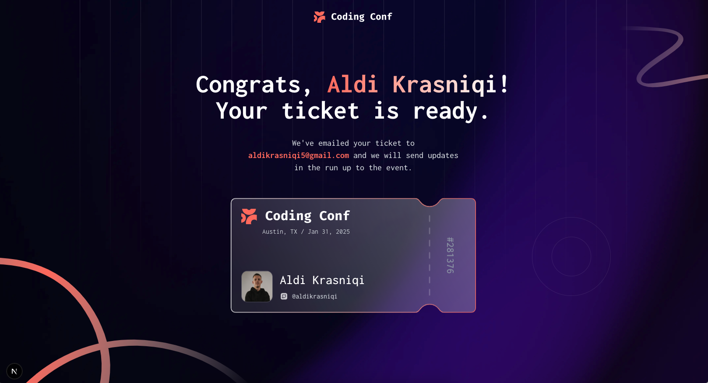

# Frontend Mentor - Conference ticket generator solution

This is a solution to the [Conference ticket generator challenge on Frontend Mentor](https://www.frontendmentor.io/challenges/conference-ticket-generator-oq5gFIU12w). Frontend Mentor challenges help you improve your coding skills by building realistic projects.

## Table of contents

- [Overview](#overview)
  - [The challenge](#the-challenge)
  - [Screenshot](#screenshot)
  - [Links](#links)
- [My process](#my-process)
  - [Built with](#built-with)
  - [What I learned](#what-i-learned)
  - [Continued development](#continued-development)
  - [Useful resources](#useful-resources)
- [Testing](#testing)
- [Author](#author)
- [Acknowledgments](#acknowledgments)

## Overview

The application provides a streamlined process for conference registration, allowing users to quickly register for the event and receive a personalized digital ticket that includes their information and a unique identifier. The focus is on user experience with real-time validation, responsive design, and clear visual feedback throughout the registration process.

### The challenge

Users should be able to:

- Complete the form with their details
- Receive form validation messages if:
  - Any field is missed
  - The email address is not formatted correctly
  - The avatar upload is too big or the wrong image format
- Complete the form only using their keyboard
- Have inputs, form field hints, and error messages announced on their screen reader
- See the generated conference ticket when they successfully submit the form
- View the optimal layout for the interface depending on their device's screen size
- See hover and focus states for all interactive elements on the page

### Screenshot




### Links

- Solution URL: [Solution](https://github.com/Aldikrasniqi/next-conf-registration)
- Live Site URL: [Prod](https://next-conf-registration.vercel.app)

## My process

### Built with

- Next and React 19.0.0
- Typescript
- Node
- Tailwind
- Shadcn UI
- React Hook Form
- Zod
- Zustand
- Jest and React Testing Library

### What I learned

I have learned hands-on experience with a full stack javascript development workflow. From UI to state management to API integration.

### Continued development

Looking to use Next.js more and more as I try to get more advanced with it.

### Useful resources

- [React Hook Form](https://react-hook-form.com/) - This helped me to get started with React Hook.
- [Zod](https://zod.dev/) - This helped me to get started with Zod.
- [Shadcn UI](https://ui.shadcn.com/) - This helped me to get started with Shadcn UI.
- [Next.js](https://nextjs.org/) - This helped me to get started with Next.js.

## Testing

The project uses Jest and React Testing Library for unit and component testing. To run the tests:

```bash
# Run tests once
npm test

# Run tests in watch mode
npm run test:watch
```

Tests are located in `src/components/__tests__` directory. Each test file corresponds to a component with the same name.

## Author

- Website - [Aldi Krasniqi](https://www.aldikrasniqi.tech)
- Frontend Mentor - [@Aldikrasniqi](https://www.frontendmentor.io/profile/Aldikrasniqi)

## Acknowledgments

I have done all of this by myself.
